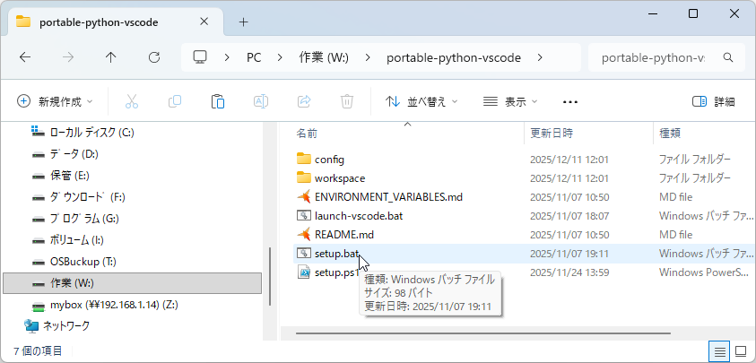
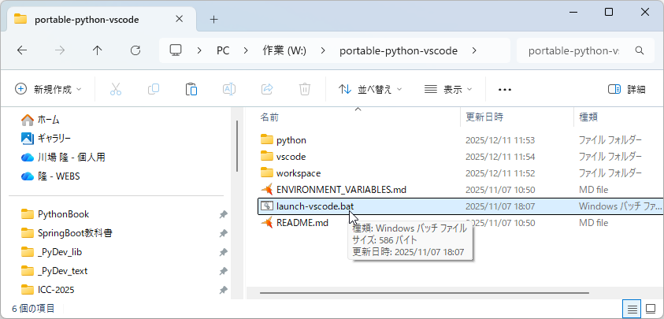
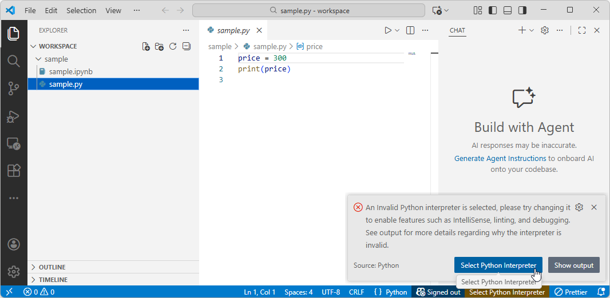
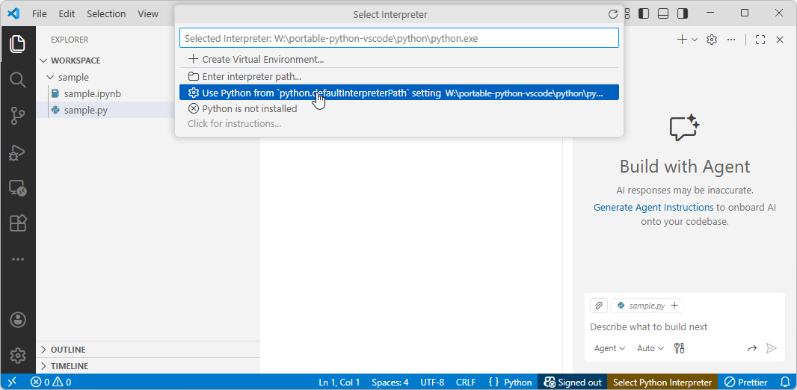
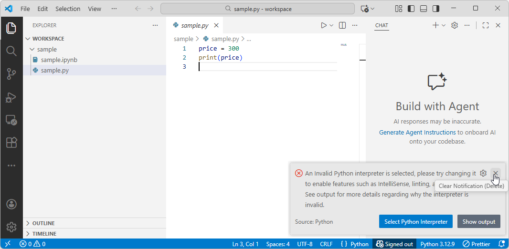

**インストールと使い方**

　・portable-python-vscode.zipを任意の場所に解凍し、以下の手順でインストールします。

　・完全にポータブルなので、どこに置いても実行できます。

①解凍したportable-python-vscodeフォルダのsetup.bat
をダブルクリックして起動する

　5~10分程度で、ダウンロードとセットアップが完了する

②portable-python-vscodeフォルダのlaunch-vscode.bat
をダブルクリックして起動する

<u>環境変数などをセットするので、必ずこの方法で起動する</u>

③samleフォルダの中のsample.pyを開いて、エディタエリアをクリックすると、Pythonを選択するウィンドウが開くので、\[Select
Python Interpreter\]のボタンをクリックする

④Use Python from python.defaultinterpreter setting ･･･ をクリックする

⑤Pythonのパスを設定するウィンドウが開くので、×をクリックして閉じる

⑥sample.ipynbをクリックすると、Jupyternotebook が開く

　★拡張子が ipnb のファイルを作るとJupyternotebookとして扱える

**その他の注意**

・画面のテーマ色はLight+です。デフォルトのDark+にするには次のようにします。

1\. VS Code の 左の下端にある歯車（⚙）アイコンをクリック

2\. 「テーマの選択（Color Theme）」 をクリック

3\. テーマ一覧が表示される

4\. 「Default Dark+」 を選ぶ

・workspaceフォルダはソースコードファイルやJupyter
notebookファイルを入れるフォルダです。

　この中に、新しいフォルダを作成し、その中にソースコード等を作成できます。
